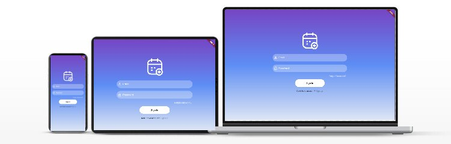

<p align="center">
    <a href="" rel="noopener">
    </a>
</p>

<h3 align="center">Event Planner</h3>

<div align="center">

  [](https://github.com/courierofcode/EventPlanner/)
  [](https://github.com/courierofcode/EventPlanner/issues)
  [](https://github.com/courierofcode/EventPlanner/blob/main/LICENSE)

</div>

---


## 📝 Table of Contents
- [About](#about)
- [Getting Started](#getting_started)
- [Usage](#usage)
- [Deployment](#deployment)
- [Built Using](#built_using)


## 🧐 About <a name = "about"></a>
TemplateAbout

## 🏁 Getting Started <a name = "getting_started"></a>
These instructions layout the process guiding design process from conception to deployment. See [deployment](#deployment) for notes on how to deploy the project on a live system.
## Design
---
### Prerequisites
```
Web Browser
```

### Features
- [x] Login & Account Signup
- [] User can Create events
- [] User can Read events
- [] User can Update events
- [] User can Delete events
- [x] Logout & Account Deletion


### Demo
<p align="center">
    <a href="" rel="noopener">
    </a>
</p>

---
## 🎈 Usage <a name="usage"></a>
TemplateAccess. These instructions will get you a copy of the project up and running on your local machine for development and testing purposes.

```
    Process...
```
## 🚀 Deployment <a name = "deployment"></a>
- Source Hosted by GitHub with CI/CD
- Cloud hosting with Firebase


## ⛏️ Built Using <a name = "built_using"></a>
[](https://docs.github.com/en)
[](https://docs.flutter.dev/)
[](https://firebase.google.com/docs)
  
